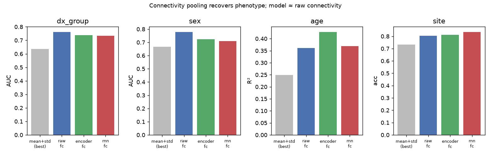

# Phenotype under connectivity pooling

522 subjects, functional connectivity reduced to 100 PCs (fit on train). Compare against the mean+std numbers in `docs/probe_report.md`.

## dx_group

Chance accuracy 0.548.

| feature | accuracy | AUC |
|---|---|---|
| raw_fc | 0.682 ± 0.040 | 0.762 ± 0.041 |
| encoder_fc | 0.674 ± 0.051 | 0.739 ± 0.050 |
| rnn_fc | 0.688 ± 0.047 | 0.734 ± 0.044 |

## sex

Chance accuracy 0.807.

| feature | accuracy | AUC |
|---|---|---|
| raw_fc | 0.782 ± 0.023 | 0.779 ± 0.024 |
| encoder_fc | 0.703 ± 0.036 | 0.724 ± 0.034 |
| rnn_fc | 0.718 ± 0.026 | 0.709 ± 0.051 |

## site

Chance accuracy 0.330.

| feature | accuracy |
|---|---|
| raw_fc | 0.805 ± 0.025 |
| encoder_fc | 0.812 ± 0.029 |
| rnn_fc | 0.835 ± 0.021 |

## age

Target std 6.74 (R²=0 is chance).

| feature | R² | MAE |
|---|---|---|
| raw_fc | 0.361 ± 0.062 | 3.83 |
| encoder_fc | 0.428 ± 0.059 | 3.61 |
| rnn_fc | 0.369 ± 0.049 | 3.75 |

## Reading

- DX-group AUC under connectivity: raw_fc=0.762, best model representation=0.739. Compare to ~0.63 under mean+std.

## Figure

