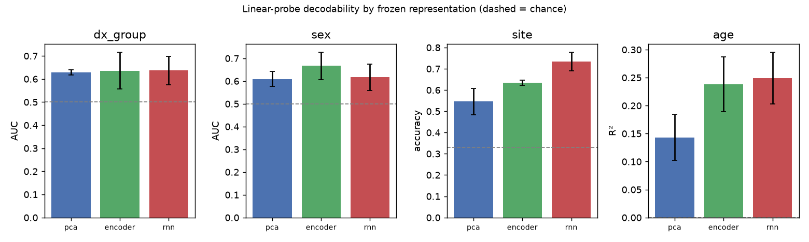

# Phase 5 — linear probing of frozen features

522 subjects (the TR=2.0s pretraining group), 5-fold cross-validated linear probes. Feature dims: encoder=256, rnn=512, pca=256.

**The prediction under test:** if the model's value is temporal, `rnn` should beat `pca`, and `encoder` should roughly match `pca`.

## dx_group

Chance accuracy 0.548 (2 classes, n=522).

| feature | accuracy | AUC | |
|---|---|---|
| pca | 0.581 ± 0.033 | 0.629 ± 0.011 |
| encoder | 0.613 ± 0.077 | 0.636 ± 0.079 |
| rnn | 0.590 ± 0.041 | 0.636 ± 0.062 |

## sex

Chance accuracy 0.807 (2 classes, n=522).

| feature | accuracy | AUC | |
|---|---|---|
| pca | 0.676 ± 0.027 | 0.610 ± 0.033 |
| encoder | 0.709 ± 0.029 | 0.667 ± 0.059 |
| rnn | 0.699 ± 0.033 | 0.617 ± 0.058 |

## site

Chance accuracy 0.330 (10 classes, n=522).

| feature | accuracy | |
|---|---|
| pca | 0.546 ± 0.061 |
| encoder | 0.634 ± 0.011 |
| rnn | 0.734 ± 0.043 |

## age

Target std 6.74 (R²=0 is chance, n=522).

| feature | R² | MAE |
|---|---|---|
| pca | 0.143 ± 0.041 | 4.47 |
| encoder | 0.238 ± 0.049 | 4.18 |
| rnn | 0.249 ± 0.046 | 4.14 |

## Reading

- **dx_group**: pca=0.629, encoder=0.636, rnn=0.636 (best: rnn); temporal features add little over the spatial encoder.
- **sex**: pca=0.610, encoder=0.667, rnn=0.617 (best: encoder); the RNN is worse than the encoder.
- **age**: pca=0.143, encoder=0.238, rnn=0.249 (best: rnn); temporal features add little over the spatial encoder.

- **Site is the RNN's clearest signal**: pca=0.546, encoder=0.634, rnn=0.734 accuracy (chance 0.330). The temporal representation's main advantage over PCA is decoding the scanner, not phenotype — the dynamics it learns are partly site-coupled, which any downstream use has to account for.

## Figure

